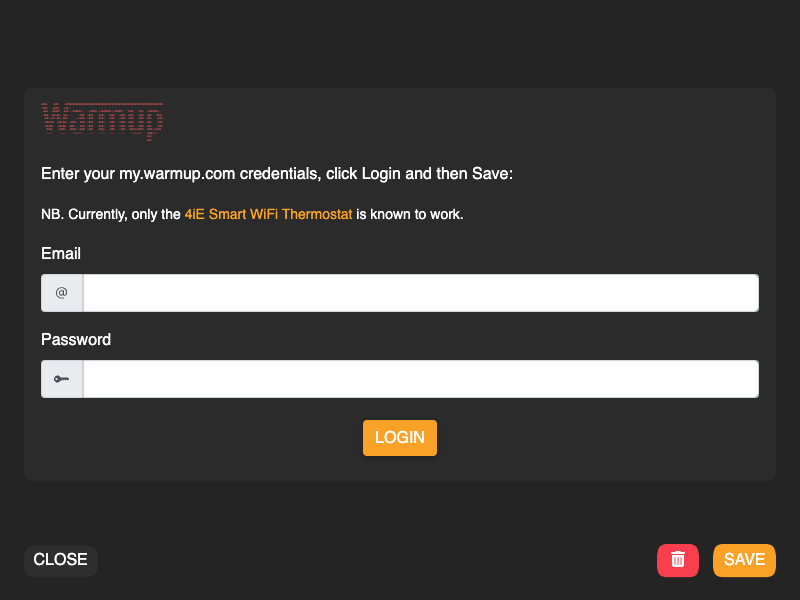
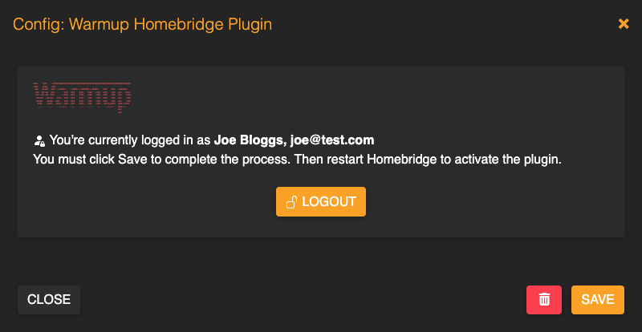
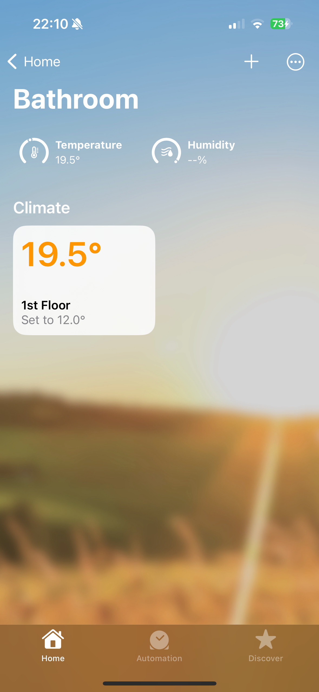
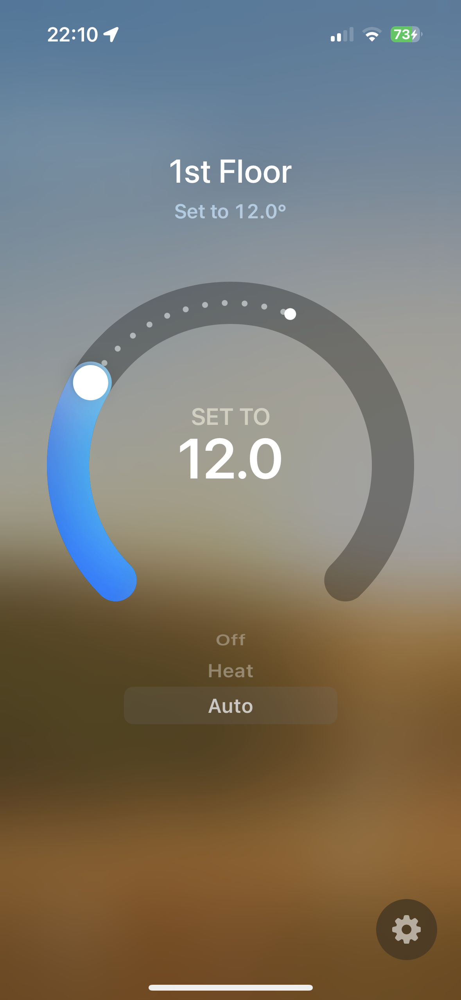

# Warmup Homebridge Plugin <!-- omit in toc -->

<pre><!-- markdownlint-disable-line MD033 -->
*###.   :###    -###################################################################:
.###=   *###=   *##=
 +##*  .#####  .### .+*####*=   :+####* =*######+:+#####=   =###   :##*  -*#####*=
 .###. =##+##- =##+  :    :###  =###    ###*   *###   +###. +###   :###  +##+  .###+
  +##= ##=.##+ ###.    .-=+###: =###    ###*   -###   :###: +###   :###  +##+   .###:
  :###+##  +##+##*  +###.  ###: =###    ###*   -###   :###: +###   :###  +##+    ###-
   #####-   #####. :###    ###: =###    ###*   -###   :###: +###   :###  +##+   -###
   -####    =###*   ####:.:###: =###    ###*   -###   :###:  ####**####  +###==*###  
    ---:     ---.     :=++==-   .---    ---:   .---    ---    .-=++==:   +###===-
                                                                         +##+
                                                                         +##+    ..  
</pre>

## Introduction <!-- omit in toc -->

Unofficial [Homebridge](https://homebridge.io) plugin exposing [Warmup smart thermostats](https://www.warmup.co.uk/thermostats/smart) to Apple's [HomeKit](http://www.apple.com/ios/home/). NB. Currently, only the [4iE](https://www.warmup.co.uk/thermostats/smart/4ie-underfloor-heating) is known to work. If you have another model, like perhaps the [6iE](https://www.warmup.co.uk/thermostats/smart/6ie-underfloor-heating), please let me know.

Warmup Homebridge Plugin automatically discovers your Warmup thermostats.

- [Using the plugin](#using-the-plugin)
  - [Installation](#installation)
    - [Login to your Warmup account](#login-to-your-warmup-account)
    - [Save your setup](#save-your-setup)
  - [Usage](#usage)
- [Temperature Control](#temperature-control)
- [Mode Setting](#mode-setting)
- [Developing](#developing)
  - [Clone and install dependencies](#clone-and-install-dependencies)
  - [Testing](#testing)
  - [Building and publishing](#building-and-publishing)
  - [Running Dockerised Homebridge for integration testing](#running-dockerised-homebridge-for-integration-testing)
- [Credits](#credits)

## Using the plugin

You will need a [MyWarmup](https://my.warmup.com) account. All thermostats are retrieved from the [my.warmup.com](https://my.warmup.com) site, and are automatically created in the Home App.

You will also need a server running [Homebridge](https://homebridge.io).

### Installation

Install the plugin by searching for "Warmup Homebridge" through the Homebridge Plugins UI or manually by:

```sh
sudo npm -g i homebridge-plugin-warmup
```

Use the plugin Config UI X to login to your account and all the thermostats you own will be added to Homebridge:

#### Login to your Warmup account



#### Save your setup



### Usage

Room View with Thermostat | Thermostat Main View
| :---------------------: | :-------------------: |
 | 

## Temperature Control

Changes to the temperature create a "temperature override" for the current setting. The override lasts for 60 minutes.  

## Mode Setting

Any temperature change will cause a 60 minute override at that temperature. However, you can also adjust mode:

| Setting | Effect                                                  |
| ------- | ------------------------------------------------------- |
| `Off`   | Turns off the thermostat                                |
| `Heat`  | Overrides the current target temperature for 60 minutes |
| `Auto`  | Resumes the current program's schedule and temperature  |

## Developing

### Clone and install dependencies

```sh
git clone git@github.com:jondarrer/homebridge-plugin-warmup
cd homebridge-plugin-warmup
npm install
```

### Testing

Run the tests with the usual command:

```sh
npm test
```

This will run the tests with a coverage report (requires 100% across the board to pass), which you can view with:

```sh
open coverage/lcov-report/index.html
```

Debug within VS Code by running the `npm run local-homebridge` task.

### Building and publishing

```sh
npm run build
npm version patch -m "%s"
git push && git push --tags
```

### Running Dockerised Homebridge for integration testing

NB. Requires `docker-compose`.

```sh
npm run containerised-homebridge
```

This will build the plugin and copy the necessary files to the appropriate places within container volume space (`./volumes/homebridge`). It will then start it, making it available at [http://localhost:8581](http://localhost:8581).

It is necessary to re-run this process on changes to the source code.

To stop the container, simply run `docker-compose down`.

## Credits

Thanks to [NorthernMan54](https://github.com/NorthernMan54) for his [homebridge-warmup4ie](https://github.com/NorthernMan54/homebridge-warmup4ie) plugin, which served as a basis for some of the logic in this one.

[ASCII Art Archive](https://www.asciiart.eu/image-to-ascii) was used to generate the ASCII art from Warmup's logo.
